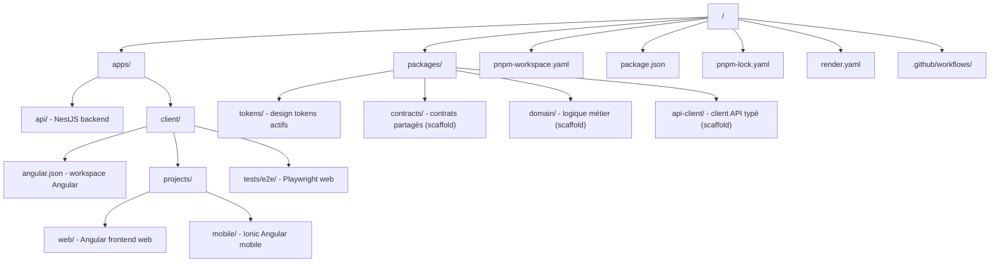

# Stack Technologique Du MVP KRAAK

## 1. Décision globale

Pour KRAAK, le meilleur compromis entre **rapidité de livraison**,
**crédibilité technique**, **SEO**, **évolutivité** et **cohérence long terme**
est :

- **Type de site :** site web marketing personnalisé, avec fondations applicatives pour les futures fonctionnalités
- **Architecture :** monorepo `pnpm`
- **Front-end :** Angular + Angular prerender/SSG
- **Back-end :** NestJS
- **Backend services :** Supabase + Resend
- **Déploiement :**
  - front-end préproduction sur **Vercel**
  - back-end préproduction sur **Render**
- **CI/CD :** GitHub Actions + Docker multi-stage builds

---

## 2. Choix finaux

### Type de site

**Choix : site web marketing personnalisé**

**Pourquoi :**

- le MVP a d’abord besoin d’un site clair, rapide et orienté conversion ;
- un CMS n’est pas nécessaire au départ puisque le contenu sera limité ;
- une application totalement dynamique serait trop lourde pour la première version ;
- l’architecture retenue garde malgré tout la possibilité d’ajouter plus tard :
  - authentification,
  - espace participant,
  - tableaux de bord,
  - stockage de fichiers,
  - logique métier.

---

## 3. Stack technique retenue

### Runtime / outillage

- **Node.js : 24.14+**
- **pnpm : 10.23.0+**
- **TypeScript : 5.9.3**
- **Git : dernière version stable**
- **GitHub : dépôt principal**
- **Docker : Dockerfile multi-stage pour l’API et la CI/CD**

### Front-end

- **Angular : 21.2.x**
  > Tous les packages `@angular/*` doivent être alignés sur **la même version exacte**
- **Angular SSR / prerender : 21.x**
- **RxJS : 7.8.x**
- **Tailwind CSS : 4.2.x**
- **PrimeNG : 21.1.x**
- **@primeuix/themes : 2.x compatible PrimeNG 21**
- **Gestion d’état : Angular Signals + services + RxJS**
  > Pas de NgRx pour le MVP

### Back-end / services

- **NestJS : 11.1.18**
- **Supabase :**
  - Database : Supabase Postgres
  - Auth : Supabase Auth
  - Storage : Supabase Storage
  - SDK JS : `@supabase/supabase-js` 2.99.2
- **Email : Resend**
- **Formulaires : API personnalisée NestJS + Resend + stockage Supabase**

### Analyse / SEO

- **Google Analytics 4**
- **Google Search Console**
- **PostHog : non retenu pour le MVP**
  - à ajouter plus tard si besoin d’analytics produit plus fines

### Gestion de contenu

- **Contenu codé en dur dans le dépôt**
  - textes dans des fichiers TypeScript / JSON / Markdown selon les besoins
- **Pas de CMS au MVP**
- **CMS plus tard** si le volume de contenu augmente

---

## 4. Pourquoi ces choix

### Angular + prerender au lieu d’une SPA pure

Le site doit être bien référencé et charger vite.  
Le meilleur compromis est de construire le front avec Angular, mais de **pré-rendre les pages marketing** à la génération du build.

**Avantages :**

- meilleur SEO ;
- pages plus rapides ;
- déploiement plus simple sur Vercel ;
- pas besoin d’un serveur SSR permanent pour les pages publiques du MVP.

### PrimeNG 21 + Tailwind

C’est cohérent avec ton choix initial.

**Avantages :**

- composants prêts à l’emploi ;
- gain de temps important ;
- design système plus rapide à mettre en place ;
- Tailwind permet d’ajuster précisément l’apparence sans repartir de zéro.

### Signals + services + RxJS pour la gestion d’état

**Choix final : Angular Signals + services + RxJS**

**Pourquoi :**

- beaucoup moins de boilerplate que NgRx ;
- plus rapide à mettre en place ;
- largement suffisant pour :
  - état UI,
  - formulaires,
  - sessions,
  - données simples,
  - catalogue de contenu ;
- NgRx pourra être ajouté plus tard si la complexité augmente.

### NestJS + Supabase

**Pourquoi :**

- NestJS fournit une vraie couche API propre, testable et évolutive ;
- Supabase couvre la base de données, l’authentification et le stockage ;
- Resend s’intègre proprement avec le back-end ;
- cette base prépare déjà les futures fonctionnalités (login, espace apprenant, uploads, suivi).

### Formulaires : API personnalisée au lieu de Formspree / Tally / Google Forms

**Choix final : API NestJS + Resend + Supabase**

**Pourquoi :**

- meilleure cohérence avec la stack ;
- contrôle total sur les validations ;
- possibilité de stocker les leads dans Supabase ;
- possibilité d’envoyer des emails transactionnels ou notifications ;
- meilleure évolutivité qu’un simple connecteur tiers.

---

## 5. Hébergement retenu

### Front-end — préproduction

**Choix : Vercel**

**Rôle :**

- héberger le front Angular pré-rendu ;
- gérer les previews par branche / pull request ;
- servir rapidement les assets statiques.

### Back-end — préproduction

**Choix : Render via `render.yaml`**

**Rôle :**

- déployer l’API NestJS ;
- gérer les variables d’environnement côté serveur ;
- garder une configuration infra versionnée dans le dépôt.

### Services managés

- **Base de données : Supabase**
- **Authentification : Supabase Auth**
- **Stockage : Supabase Storage**
- **Emails : Resend**

---

## 6. Processus de déploiement recommandé

### État actuel du repo

- le workspace Angular vit dans `apps/client`
- le site web est dans `apps/client/projects/web`
- l'application mobile est dans `apps/client/projects/mobile`
- `packages/tokens` est actif ; `packages/contracts`, `packages/domain` et
  `packages/api-client` sont déjà scaffoldés mais encore vides
- l'API expose aujourd'hui un bootstrap minimal avec une route health et des
  répertoires métier déjà préparés

## Structure du dépôt

## Pipeline CI/CD

### À chaque Pull Request

- installation via `pnpm`
- lint
- tests
- build du front
- build de l’API
- build Docker de l’API

### À chaque push sur la branche de préproduction

- **Vercel** build le workspace client et publie `apps/client/dist/web/browser`
- **Render** déploie `apps/api` à partir du `render.yaml`

### Docker

**Choix : oui, Docker dans le pipeline CI/CD**

**Usage recommandé :**

- Docker multi-stage pour l’API NestJS ;
- image reproductible entre local, CI et Render ;
- validation du build en CI avant déploiement.

**Remarque :**

- Docker est indispensable côté API ;
- il n’est pas nécessaire pour le front Vercel au MVP.

---

## 7. Fichiers de configuration à prévoir

### Racine

- `package.json`
- `pnpm-workspace.yaml`
- `tsconfig.base.json`
- `.npmrc`
- `.node-version` ou `.nvmrc`
- `pnpm-lock.yaml`

### Front

- `vercel.json`
- `apps/client/angular.json`
- `apps/client/projects/web/src/tailwind.css`
- `apps/client/projects/web/src/app/app.routes.server.ts` si rendu hybride/prerender avancé

### Back

- `apps/api/Dockerfile`
- `render.yaml`

### CI/CD

- `.github/workflows/ci.yml`
- d'autres workflows de déploiement seulement si le besoin réel apparaît

---

## 8. Variables d’environnement recommandées

### Variables client (`apps/client/.env.example`)

- `KRAAK_WEB_PORT` — port du serveur de dev Angular (scripts / Playwright)

> Angular utilise des fichiers `environment.ts` compilés à la build, pas des
> variables `.env` à l'exécution.

### Variables back-end (`apps/api/.env.example`)

- `NODE_ENV`
- `PORT`
- `CORS_ALLOWED_ORIGINS`
- `SUPABASE_URL`
- `SUPABASE_SECRET_KEY`
- `RESEND_API_KEY`
- `CONTACT_TO_EMAIL`

Les mêmes variables s'appliquent en staging (`apps/api/.env.staging.example`)
avec des valeurs adaptées.

### Variables optionnelles mais utiles

- `LOG_LEVEL`
- `RATE_LIMIT_TTL`
- `RATE_LIMIT_LIMIT`

---

## 9. Décision finale recommandée

La stack MVP recommandée pour KRAAK est donc :

- **Monorepo : pnpm workspaces**
- **Langage : TypeScript 5.9.3**
- **Runtime : Node.js 24.14+**
- **Front-end : Angular 21.2.x + prerender**
- **UI : PrimeNG 21.1.x + Tailwind CSS 4.2.x**
- **État : Signals + services + RxJS**
- **API : NestJS 11.1.18**
- **Base / Auth / Storage : Supabase**
- **Emails : Resend**
- **Formulaires : API personnalisée**
- **Analytics : GA4 + Search Console**
- **Front hosting : Vercel**
- **API hosting : Render**
- **CI/CD : GitHub Actions + Docker**

---

## 10. Résumé en une phrase

La meilleure option pour ce MVP est un **site marketing Angular pré-rendu, déployé sur Vercel, soutenu par une API NestJS sur Render, avec Supabase pour les services backend, pnpm pour le monorepo, et Docker pour fiabiliser la CI/CD**.
