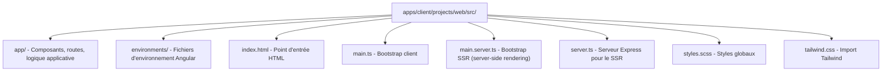

# Guide du mode développement

Ce guide explique comment lancer et utiliser chaque application du monorepo en développement.

---

## Prérequis

Avant de lancer quoi que ce soit :

1. **Node.js 24+** installé (`node -v` pour vérifier)
2. **pnpm 10+** activé (`pnpm -v` pour vérifier)
3. Dépendances installées : `pnpm install` à la racine
4. Fichiers `.env` configurés (voir ci-dessous)

### Configurer les variables d'environnement

```bash
# Backend
cp apps/api/.env.example apps/api/.env

# Client (optionnel, utile pour Playwright / scripts)
cp apps/client/.env.example apps/client/.env
```

Remplir les valeurs — voir [`ENVIRONMENT_VARIABLES.md`](ENVIRONMENT_VARIABLES.md) pour la référence complète.

**Variables minimales pour développer en local :**

| Variable                    | Fichier         | Exemple                        |
| --------------------------- | --------------- | ------------------------------ |
| `SUPABASE_URL`              | `apps/api/.env` | `http://127.0.0.1:54321`       |
| `SUPABASE_SERVICE_ROLE_KEY` | `apps/api/.env` | clé fournie par Supabase local |

---

## Lancer le site web (Angular SSR)

```bash
pnpm dev:web
```

- URL : **http://localhost:4200**
- Hot-reload : oui (les modifications dans `apps/client/projects/web/` se reflètent automatiquement)
- Commande sous-jacente : `ng serve web`
- Option utile pour les tests/outils en PowerShell :
  `$env:KRAAK_WEB_PORT='4201'; pnpm.cmd --filter @kraak/client exec playwright test`

### Structure du code web



---

## Lancer l'API (NestJS)

```bash
pnpm dev:api
```

- URL : **http://localhost:3000**
- Hot-reload : oui (`nest start --watch`)
- Tester que ça tourne : `curl http://localhost:3000` (devrait retourner une réponse)

### Structure du code API

```mermaid
flowchart TD
    apisrc["apps/api/src/"]
    apisrc --> apimain["main.ts - Point d'entrée, bootstrap NestJS"]
    apisrc --> apimodule["app.module.ts - Module racine actuel"]
    apisrc --> apicontroller["app.controller.ts - Route health (GET /health)"]
    apisrc --> apiservice["app.service.ts - Service principal"]
    apisrc --> apiannouncements["announcements/ - Répertoire métier scaffoldé"]
    apisrc --> apiauth["auth/ - Répertoire métier scaffoldé"]
    apisrc --> apidashboard["dashboard/ - Répertoire métier scaffoldé"]
    apisrc --> apiprograms["programs/ - Répertoire métier scaffoldé"]
    apisrc --> apiresources["resources/ - Répertoire métier scaffoldé"]
    apisrc --> apisupport["support/ - Répertoire métier scaffoldé"]
```



> À ce stade, `AppModule` reste minimal et les répertoires métier servent encore
> surtout de structure cible.

---

## Lancer l'app mobile (Ionic + Capacitor)

```bash
pnpm dev:mobile
```

- URL : **http://localhost:4300**
- Hot-reload : oui
- Commande sous-jacente : `ng serve mobile --port 4300` via la commande racine `pnpm dev:mobile`

> **Note :** Pour tester sur un appareil physique ou un émulateur, il faut configurer Capacitor séparément. Ce mode lance uniquement l'aperçu web.

---

## Lancer plusieurs apps en même temps

Les trois apps peuvent tourner en parallèle avec une seule commande :

```bash
pnpm dev
```

- Web : **http://localhost:4200** par défaut, ou le prochain port libre
- Mobile : **http://localhost:4300** par défaut, ou le prochain port libre
- API : **http://localhost:3000**

Le script `pnpm dev` sonde les ports web et mobile avant démarrage pour éviter
une première tentative en échec quand `4200` ou `4300` sont déjà utilisés.

Pour les outils qui doivent cibler explicitement le serveur web local
(notamment Playwright), la variable `KRAAK_WEB_PORT` permet d'aligner l'URL de
base sur le port réellement utilisé.

Si le site web local consomme l'API et tourne sur un port différent de `4200`,
penser aussi à aligner `CORS_ALLOWED_ORIGINS` côté API locale.

Si vous avez besoin de lancer une seule app, les commandes `pnpm dev:web`, `pnpm dev:mobile` et `pnpm dev:api` restent disponibles.

> Si le port `3000` est déjà occupé, `pnpm dev` ne relance pas l'API sur un autre port, car le front local continue d'attendre l'API sur `http://localhost:3000`.

---

## Commandes de test

```bash
# Tous les tests
pnpm test

# Vérifier uniquement le runner de test racine
pnpm test:workspace

# Tests unitaires API (Jest)
pnpm test:api

# Tests unitaires client en une exécution (via `ng test --watch=false`)
pnpm test:unit

# Tests unitaires client en watch
pnpm --filter @kraak/client test:watch

# Tests E2E web (Playwright dans apps/client/tests/e2e)
pnpm test:e2e
```

Le runner racine exécute les phases dans cet ordre : bibliothèques partagées,
tests API + client, puis E2E web.

---

## Commandes de build

```bash
# Tous les builds
pnpm build

# Builds ciblés
pnpm build:web
pnpm build:mobile
pnpm build:api
```

---

## Commandes de qualité

```bash
# Vérifier le formatage
pnpm format:check

# Formater automatiquement
pnpm format

# Lancer le linter
pnpm lint

# Linter uniquement l'API
pnpm lint:api
```

---

## Dépannage courant

### `pnpm install` échoue

- Vérifier la version de Node : `node -v` (doit être ≥ 24.14)
- Vérifier la version de pnpm : `pnpm -v` (doit être ≥ 10)
- Supprimer le cache et réessayer : `rm -rf node_modules && pnpm install`

### Le port 4200 ou 3000 est déjà utilisé

- Fermer l'autre processus qui utilise le port
- Ou changer le port : `ng serve web --port 4201`
- Ou lancer `pnpm dev` pour laisser le script choisir automatiquement le
  prochain port libre côté web/mobile

### Les hooks Git bloquent mon commit

- Formatage : `pnpm format` puis réessayer
- Lint : corriger les erreurs ESLint
- Message de commit : relancer `pnpm commit`
- Voir [`CONTRIBUTING.md`](../../CONTRIBUTING.md) pour les détails

### Les variables d'environnement ne sont pas reconnues

- Vérifier que le fichier `.env` existe à la racine
- Redémarrer le serveur de développement après avoir modifié un `.env`

### Vite échoue avec `EPERM ... .angular/cache ... deps_temp`

- Ce cas apparaît parfois sous Windows quand Vite réoptimise les dépendances
  après un changement de lockfile
- `pnpm dev` tente maintenant de nettoyer le cache Angular/Vite du projet
  concerné puis de relancer automatiquement le service
- Si le verrou persiste, arrêter les serveurs, supprimer `apps/client/.angular/cache/`,
  puis relancer `pnpm dev`
